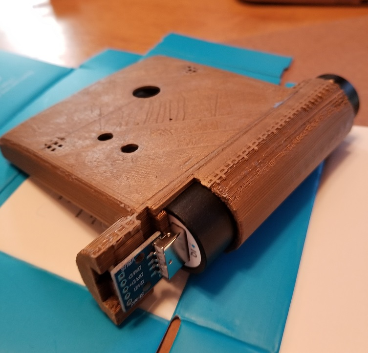
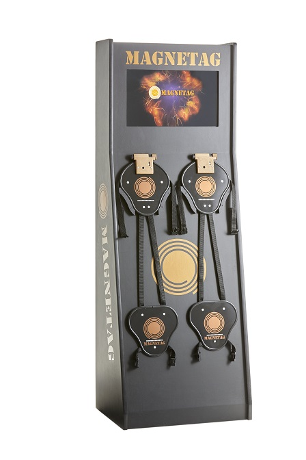

Welcome to MagneTag! We know you're anxious to play your first game -- this guide will help you get up and running as quickly as possible.

# Identifying Your MagneTag System

Before getting started, take a minute to [get to know your MagneTag system](know-your-system.md). This will help you ensure you've got all the hardware you need. It'll also help you identify your system -- this will make the rest of the documentation here a lot easier to understand.

# Turn it on
To get started, plug everything in and turn it on.

Insert the batteries into the armor vests. Power banks need to be turned on first; there is a small button near the charging port. When you press the button on the power bank, the color will indicate how charge is left (green - full charge, yellow - some charge, red - needs to charge)

It might take a few minutes for everything to turn on. Once it's all on, your armor vests should light up. The screen on the PC should show a video of people playing MagneTag.

The lights on the armor will indicate the connection status of each device

* Solid white lights - the vests are trying to connect to the network.  If this status persists for more than 60 seconds, follow [these instructions](configure-network.md) to edit the logon credentials.
* Sweeping white lights - the vests are connected, but not assigned to a controller. An admin needs to log into the software and assign the devices using [these instructions](assign-device.md)
* Sweeping colored lights - the device is connected and ready to start a game
* Pulsing colored lights - the device is actively in a game

The computer display will show an "Uh-Oh" message until the armor connects to the network.  Once the armor is connected, you can use the touch screen to navigate the game. In self-service mode, the system operation is designed to be very clear. Follow the on-screen instructions.

# Have some fun!

You're ready to play some games!

Choose the appropriate guide for your system:
* [Run Self-Service (Kiosk) Mode](run-kiosk-mode.md)
* [Run Full-Service (FEC) Mode](run-fec-mode.md)
